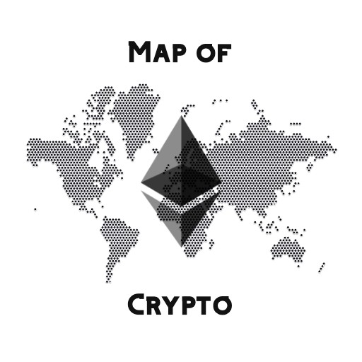

<h1>

  
   Map of Crypto
</h1>
  

    A place where buyers and sellers from all around the world meet.
     
    

 
 

## About The Project
Map of Crypto is the decentralized marketplace dapp, where people from all around the world can exchange various goods.

## Idea

There are already many web2 apps where you can buy and sell things, however scalability has always been a problem. Different currencies, high subscriptions fees, and limited choice are only the few things to mention. With Map of Crypto, we aim to unleash the power of native crypto payments, with Matic as a global and common currency.

We don't ask our users to create account on our platform or anything like that, we don't even control the transactions. Everything happens in the code, and users are always the owners of their data, money, and products.

## Technology

<h3 >
  FrontEnd
</h3>

 

<h3 >
  Web3
</h3>

